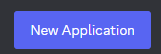
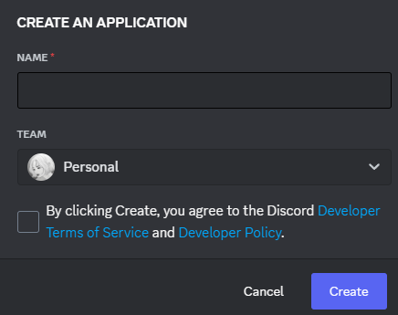
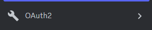
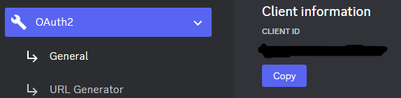

<h1 align="center">Discord-Rich-Presence <a href="https://github.com/SAMURASA/Discord-Rich-Presence/releases" target="_blank">Download</a> 
</h1>
<h3 align="center">How it works?</h3>

First, you need to switch to <a href="https://discord.com/developers/applications">Discord Dev Portal</a>, log in and click on the button - <table><td></td><tr><td>Next, enter the name of the application, it will be displayed and visible to everyone</td><tr><td>Next, go to the OAuth2 tab</td><tr><td></td><tr><td>Copy the CLIENT ID and paste it into the application<tr></td><td></td>
</table>

So we are connected, it remains to fill in the fields

**state** - Your status
 
**largeimg** - Here we specify a link to a gif or image
 
Example: https://media1.tenor.com/m/9QJC27qGEJcAAAAC/hi-silly.gif
 
**largetext** - Text when hovering over an image
 
**Button Label** - Button name
 
**Button Link** - Button link
 
Example: https://www.youtube.com
